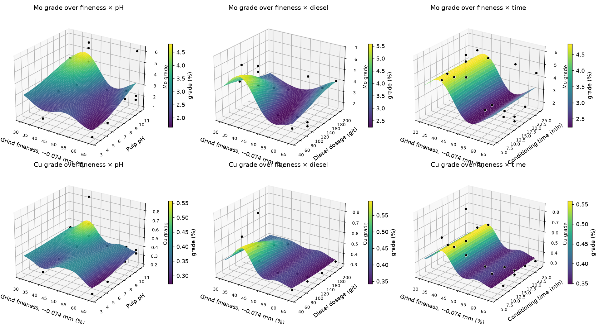
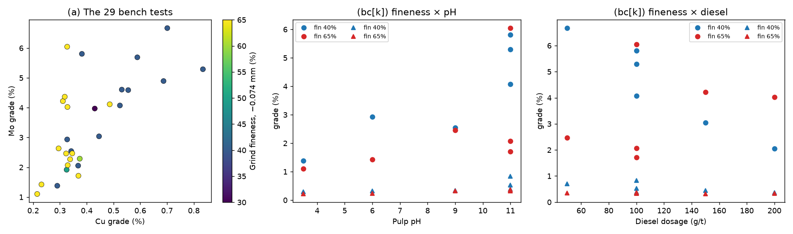
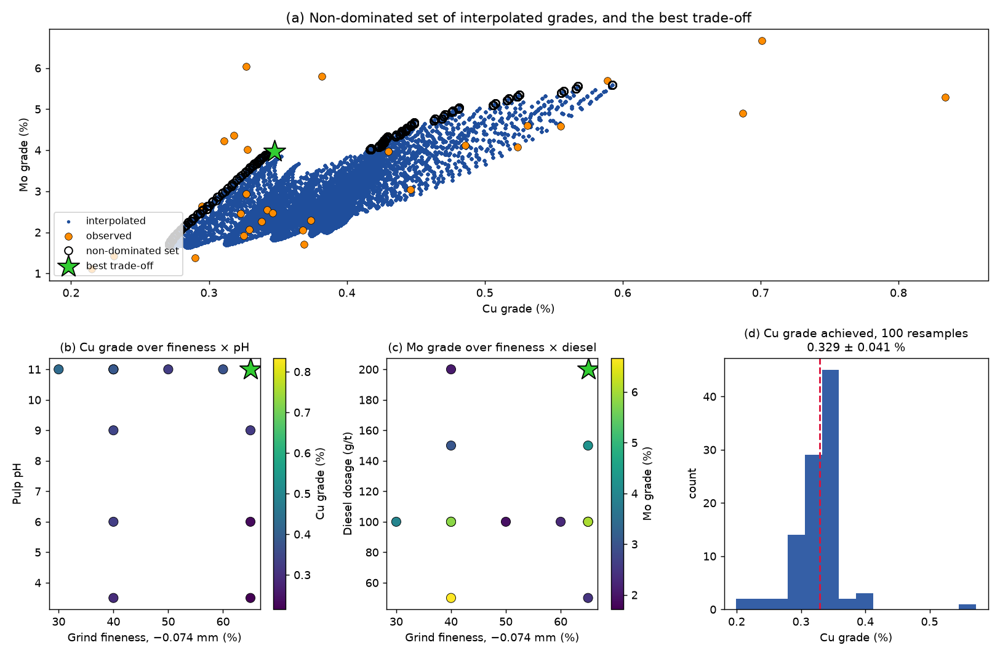
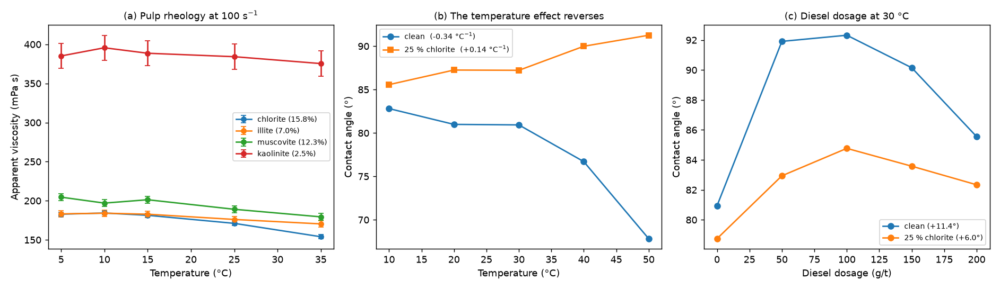
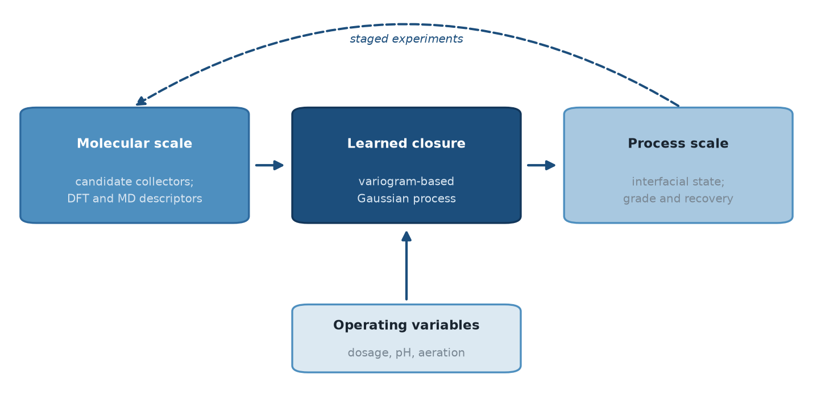
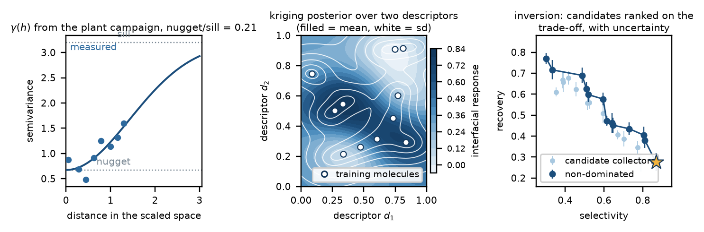

# GPR_Flotation_Cu_Mo

Variogram-based Gaussian process regression of **concentrate grade** in
copper–molybdenum flotation, applied to a two-year campaign at the
Jinduicheng molybdenum concentrator (Shaanxi, China). The prior
covariance is built in the spirit of Eskanlou, Yin & Caers (2026), with
an automatic relevance determination kernel and a nugget estimated from
the data.

The question is commercial: the copper grade in the molybdenum
concentrate has to come down. The model answers it, and also reports
what these four operating variables cannot do.

Draft preprint: `paper/manuscript.pdf`

Research note: `research_idea/research_idea.pdf` — what I would do next.



*Fitted kriging surfaces, taken as slices through the validated four-dimensional model. Points are the tests lying on each plane.*

---

## The campaign is three two-factor planes, not an unstructured OFAT set

Every reagent sweep was run from the same two anchor values of grind
fineness, 40 % and 65 %; the fineness sweep was run at the anchor values
of the reagents. So the design is

| plane | tests on it |
|---|---|
| fineness × pH (3.5 / 6 / 9 / 11) | 15 |
| fineness × diesel (50 / 100 / 150 / 200 g/t) | 15 |
| fineness × time (5 / 10 / 15 / 20 / 25 min) | 17 |

with the fineness sweep lying on the shared axis of all three. The
fineness × reagent interaction is therefore identified, and a
two-dimensional kriging surface is meaningful on each plane. Reagent ×
reagent interactions are not sampled.

The surfaces are taken as **slices through the validated 4-D model**,
not as separate two-parameter fits. A separate fit on 15 points
cross-validates far worse (Q² between −0.01 and 0.40) because it throws
away what the other factors carry.



*(a) The twenty-nine bench tests, coloured by grind fineness. (b), (c) The fineness × pH and fineness × diesel planes.*

## Grade, not recovery

| quantity | reproducible from the archive |
|---|---|
| Mo grade × concentrate mass → Mo recovery | **29 / 29** |
| Cu grade (archive vs published figures) | **29 / 29** |
| Cu recovery | 15 / 29 |

The copper recovery of a test depends on a feed assay that was not
archived with it, so it cannot be reconstructed. Grade is a direct
measurement of the concentrate.

## Results

**Prediction**

| Response | Q² | RMSE | observed sd | ΔQ² fineness / pH / diesel / time |
|---|---|---|---|---|
| Mo grade (%) | 0.434 | 1.155 | 1.56 | 0.287 / **0.380** / 0.193 / **0.000** |
| Cu grade (%) | 0.527 | 0.099 | 0.147 | **0.453** / 0.265 / 0.094 / **0.000** |

Conditioning time contributes nothing under either criterion — its
length scale sits at the optimisation bound and withholding it changes
Q² by 0.000. The apparent structure in the time series is scatter. The
empirical variograms give a nugget-to-sill ratio of 0.21 for both
responses.

**The recommended window**

```
compromise point on the non-dominated set (747 of 160,000 grid points)
    fineness 65 %, pH 11, diesel 200 g/t, time ~24 min
    -> 3.97 % Mo, 0.347 % Cu

nearest measured test (#20, same fineness/pH/diesel)
    -> 4.02 % Mo, 0.328 % Cu          agrees to 0.02 pp Cu

one hundred data resamples of the recommended point
    fineness 63 ± 6 %, pH 9.3 ± 2.2, diesel 154 ± 28 g/t
    achievable Cu grade, subject to Mo >= 3.5 %:
        0.329 ± 0.041 %   (5–95 %: 0.265 – 0.364)
```

The settings are less well determined than the grade they deliver, which
is why the recommendation is given as a grade with an interval.



*(a) Interpolated grades with the non-dominated set and the best trade-off. (b), (c) Projections into input space with the recommended point marked. (d) Copper grade achieved at the constrained optimum over one hundred data resamples.*

**Plant validation**

Three lines surveyed at the same six fineness levels give a pure error
of 0.819 pp on Mo grade (df = 15) against a total spread of 4.080 across
the fineness range — a signal-to-noise ratio of about 5. For Cu grade,
0.053 against 0.215. All three lines peak in Mo grade at 65 % and
bottom in Cu grade at 70–75 %, which places the optimum at 65–70 %
rather than at the bench boundary of 65 %.

**What the window does not fix**

| | |
|---|---|
| corr(Mo grade, Cu grade) | +0.678 |
| Cu/Mo ratio, fitted directly | **Q² = −0.072** |
| Cu/Mo ratio, from the two LOO models | **Q² = −0.002** |

Both routes agree that the operating variables control how much material
floats, not how well the sulphides separate. Forcing Mo grade to 4 %
raises the best achievable Cu grade to 0.416 %.

**Where selectivity does respond** (same campaign)

| clay | viscosity fall, 5→35 °C | replicate spread |
|---|---|---|
| chlorite | 15.8 % | 5.1 |
| muscovite | 12.3 % | 8.5 |
| illite | 7.0 % | 8.1 |
| kaolinite | 2.5 % | **32.1** |

Kaolinite doubles the viscosity (≈385 vs 180–205 mPa s) and shows no
detectable temperature response — its coefficient is smaller than its
own reproducibility, which is the honest way to state it.

```
contact angle vs temperature
    clean concentrate      dθ/dT = −0.34 °C⁻¹   (82.8° → 67.8°, 10→50 °C)
    with 25 % chlorite     dθ/dT = +0.14 °C⁻¹   (85.6° → 91.3°)
```

The sign reverses. Heating a pulp therefore helps or hurts molybdenum
floatability depending on its clay loading — a mechanism for the
seasonal variation that motivated the campaign, not yet an operating
rule for it.



*(a) Apparent viscosity against temperature for four clays. (b) Contact angle against temperature in the two systems: the correlation with temperature changes from negative to positive once clay is present. (c) Contact angle against diesel dosage.*

---

## Layout

```
data/flotation_bench.csv    29 bench tests: 4 factors, Mo and Cu grade
data/flotation_plant.csv    3 plant fineness surveys, 18 grade measurements
data/rheology.csv           viscosity vs temperature, clay, shear rate
data/wettability.csv        contact angle vs temperature, clay, diesel
code/build_datasets.py      archival: how the four CSVs were derived
code/run_analysis.py        fits the models, writes the eight figures
figures/                    eight figures
paper/manuscript.pdf        9-page draft
research_idea/              two-page research note, LaTeX source and figure scripts
```

## Run

```bash
pip install numpy pandas scipy scikit-learn matplotlib
python code/run_analysis.py
```

About twenty seconds. `code/build_datasets.py` additionally needs
`XRF数据处理.xlsx` and the extracted `origin_data/` tree from the
campaign archive, which are not redistributed here; it is included so
the derivation of every CSV is auditable.

## Data provenance and what was corrected

Values were recovered from Origin objects embedded in the campaign's
Word report, cross-checked against the raw `XRF数据处理.xlsx` workbook.
Four things needed resolving:

1. **Grade column.** Mo grade differs between the workbook and the
   published figures in 7 of 29 tests. In every case the workbook value
   satisfies the mass balance, so the workbook is followed. Cu grade
   agrees in all 29.
2. **Condition strings.** The diesel series writes the dosage into the
   pH slot (`"40% 18 12d 15min 3d 10min"`), so the strings cannot be
   parsed mechanically. Dosages for that series were recovered from the
   report's own figure 3-39, where the same grades appear against
   50/100/150/200 g/t.
3. **Yield column.** 5 of 29 entries disagree with concentrate mass over
   the 300 g feed. Yields were recomputed from the masses.
4. **Temperature axes.** Not stated in the extracted records. Recovered
   by requiring shared conditions to agree: the diesel sweep at 0 g/t
   reproduces the third point of the clean temperature sweep (fixing
   that series at 30 °C), and the chlorite content sweep at 25 %
   reproduces the first point of the chlorite temperature sweep (fixing
   that series at 10 °C).

## Reference

```bibtex
@article{eskanlou2026gpr,
  author  = {Eskanlou, Amir and Yin, David Zhen and Caers, Jef},
  title   = {Gaussian process regression for modeling computational and
             experimental mineral processing data},
  journal = {Minerals Engineering},
  volume  = {237}, pages = {110000}, year = {2026},
  doi     = {10.1016/j.mineng.2025.110000}
}
```

## Research note: from this analysis to reagent design

Everything above is the substrate for a question this repository does not
answer. The four variables the plant can adjust govern the mass pull and
not the selectivity of the separation, so the copper penalty is not
reachable from the dosage and the search has to move one level down, to
the molecule.

`research_idea/research_idea.pdf` is a two-page note setting out a
framework that does this. It keeps the variogram-based Gaussian process
of Eskanlou, Yin & Caers as the learning step and moves it into molecular
descriptor space: periodic DFT and explicit-water molecular dynamics
supply descriptors for a family of collectors, the Gaussian process maps
those descriptors together with the plant variables to the interfacial
state and the flotation response, and the posterior is inverted to rank
candidate molecules with uncertainty intervals on the selectivity–recovery
trade-off. A block of experimental conditions, reserved before any model
is fitted and never used in fitting, tests whether the ranking transfers
to conditions the model has not seen.



*The molecular scale and the process scale, joined by a single learned closure (Fig. 1 of the note).*



*(a) The variogram recovered from this repository's own campaign data — the nugget is the finite reproducibility of a flotation test. (b) A worked kriging posterior over two molecular descriptors. (c) Candidates ranked on the selectivity–recovery trade-off, with intervals (Fig. 2 of the note).*

The note and its figures are reproducible from `research_idea/`: the
LaTeX source and the three plotting scripts are included.

## Data source

The datasets in `data/` are the author's own: bench flotation tests,
plant surveys, and pulp rheology and concentrate wettability
measurements from a two-year campaign at the Jinduicheng molybdenum
concentrator, Shaanxi. Use is governed by the notice below.

MIT License, code only.

---

## Data use

**The data in `data/` are the author's own and are not open data.** They
are released for reading and for checking the analysis only. Any other
use — reproduction in a journal article, in a thesis, in a report, in
teaching material, or in any commercial or industrial application —
requires the author's prior written permission.

The MIT licence above covers the code in `code/` only. It does not
extend to the data.

---

## Contact

**Sicheng Mu (穆思成)**
School of Resources Engineering
Xi'an University of Architecture and Technology
Xi'an 710055, Shaanxi, China

Email: **sichengmu2026@163.com**
